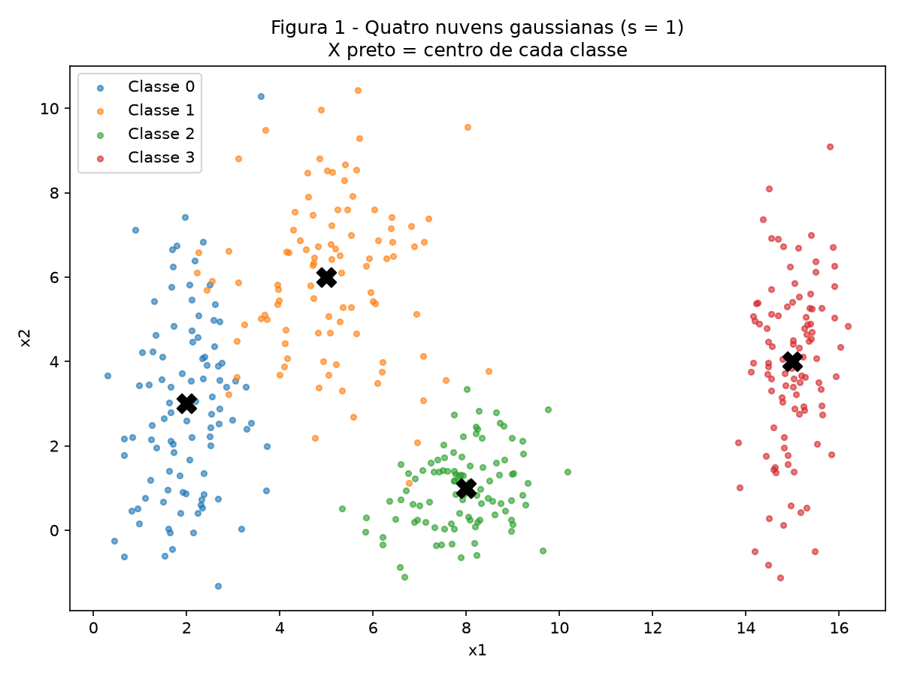
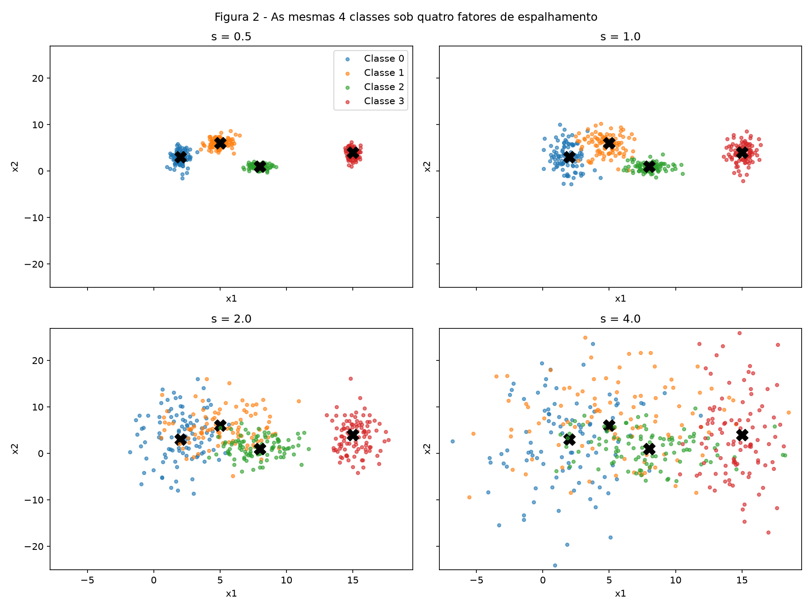
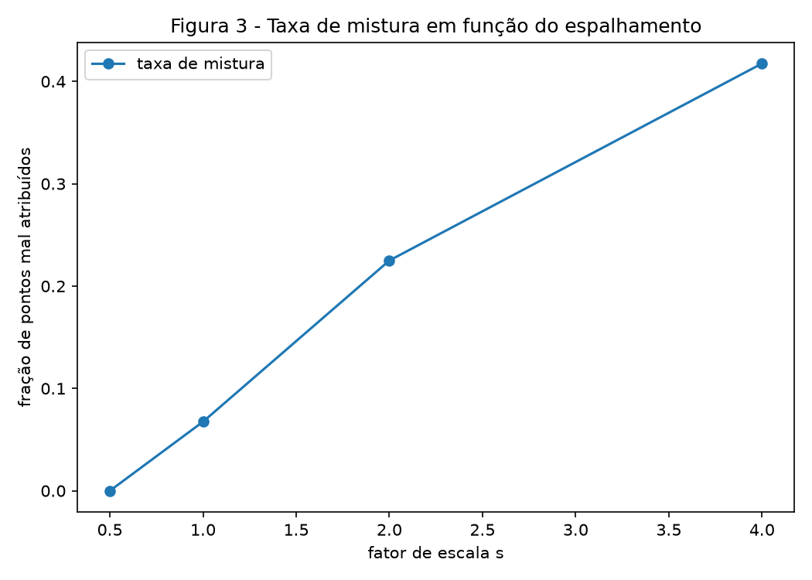
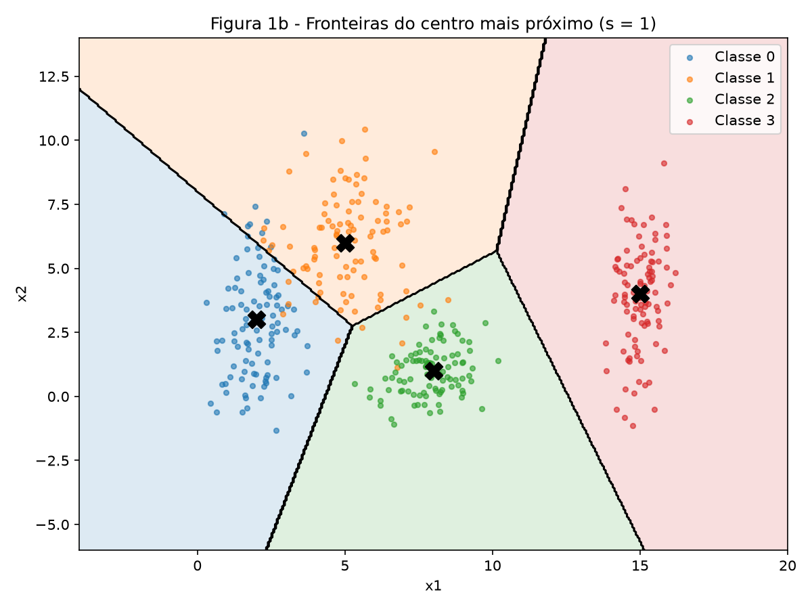
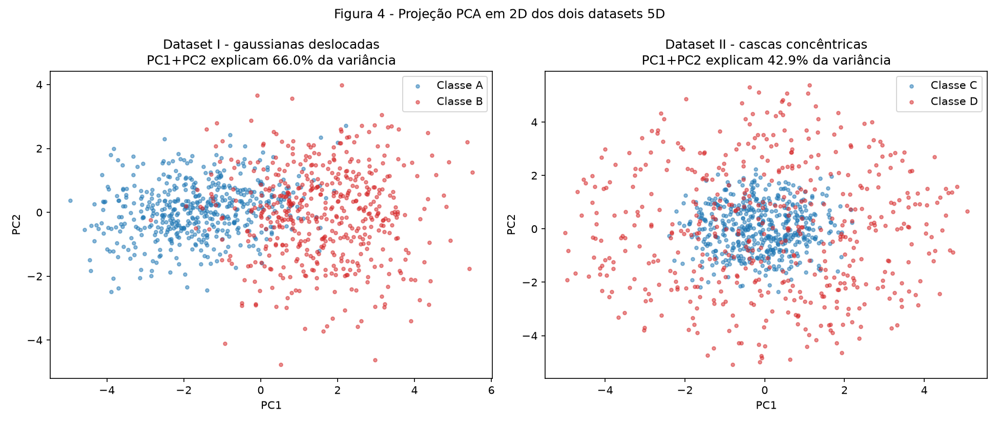
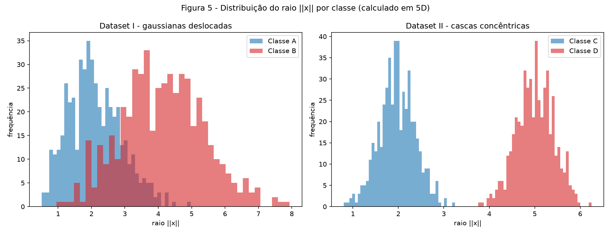
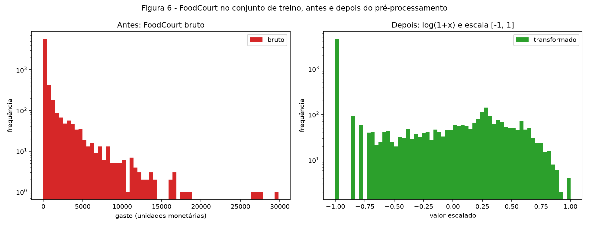

# Data — Preparação e Análise de Dados para Redes Neurais

O fio condutor da atividade é o espalhamento dos dados: quanto uma nuvem de pontos se abre, em que direção, e como isso muda a dificuldade da classificação.

!!! note "Reprodutibilidade"
    Cada script começa com `rng = np.random.default_rng(42)` e usa esse mesmo gerador até o fim. Nenhum modelo é treinado. Bibliotecas: `numpy`, `pandas`, `matplotlib` e `scikit-learn` (só PCA e pré-processamento).

    Os três scripts estão em `code/` e rodam a partir de um clone limpo, com `pip install -r requirements.txt`. O `train.csv` do Spaceship Titanic está versionado em `dataset/`.

---

## Exercício 1

Nuvens de Pontos: Geometria e Espalhamento em 2D

Medi a separação das nuvens de duas formas independentes: uma analítica, a razão $r_{ij}$, que só usa os parâmetros das gaussianas; e uma empírica, a taxa de mistura, que conta pontos. As duas chegam à mesma conclusão, e é isso que sustenta a análise do item C.

### A — Gere as nuvens

400 amostras, 100 por classe, cada uma gaussiana com desvio padrão independente por eixo:

| Classe | Média | Desvio padrão |
|---|---|---|
| 0 | [2, 3] | [0,8 ; 2,5] |
| 1 | [5, 6] | [1,2 ; 1,9] |
| 2 | [8, 1] | [0,9 ; 0,9] |
| 3 | [15, 4] | [0,5 ; 2,0] |



A geometria se lê no gráfico. A classe 2 é a mais compacta, com desvio 0,9 nos dois eixos. A classe 0 é alongada na vertical: seu $\sigma_y = 2{,}5$ é mais de três vezes o $\sigma_x$. As classes 0 e 1 são vizinhas próximas e a classe 3 está isolada à direita.

### B — Mais ou menos espalhado

As mesmas quatro classes, geradas quatro vezes, com todos os desvios multiplicados por $s \in \{0{,}5\ ;\ 1{,}0\ ;\ 2{,}0\ ;\ 4{,}0\}$. As médias não mudam, só o espalhamento.



Os quatro subplots usam os mesmos limites de eixo, então a comparação é honesta: o que cresce na imagem é a nuvem, não a escala.

#### Razão de separação em $s = 1$

$$r_{ij} = \frac{\|\mu_i - \mu_j\|}{\bar\sigma_i + \bar\sigma_j}, \qquad \bar\sigma_k = \frac{\sigma_{k,x} + \sigma_{k,y}}{2}$$

| Par | $r_{ij}$ |
|---|---|
| (0, 1) | **1,326** ← menor |
| (0, 2) | 2,480 |
| (0, 3) | 4,496 |
| (1, 2) | 2,380 |
| (1, 3) | 3,642 |
| (2, 3) | 3,542 |

O menor é o par (0, 1), com $r_{01} = 1{,}326$, as duas nuvens vizinhas do canto esquerdo.

Como as médias são fixas e só os desvios escalam por $s$, o numerador de $r_{ij}$ não muda e o denominador é multiplicado por $s$. Logo $r_{ij}(s) = r_{ij}(1)/s$, e em $s = 2$ basta dividir por 2: $r_{01} = 0{,}663$.

#### Taxa de mistura

Fração de pontos cujo centro de classe mais próximo não é o da própria classe. É uma medida geométrica: comparo cada ponto às 4 médias, sem treinar nada.

| $s$ | Taxa de mistura | Pontos mal atribuídos |
|---|---|---|
| 0,5 | 0,0000 | 0 de 400 |
| 1,0 | 0,0675 | 27 de 400 |
| 2,0 | 0,2250 | 90 de 400 |
| 4,0 | 0,4175 | 167 de 400 |



A partir de qual fator de escala as nuvens deixam de poder ser separadas por retas? A partir de $s = 2$. O critério é numérico, não visual: em $s = 2$ o menor par cruza o limiar $r_{ij} = 1$ e cai para 0,663. Quando $r_{ij} < 1$, a distância entre os centros fica menor que a soma dos espalhamentos típicos das duas nuvens, ou seja, elas se interpenetram e não existe reta que as separe.

A taxa de mistura acompanha: sobe de 6,75% em $s = 1$ para 22,5% em $s = 2$, e chega a 41,75% em $s = 4$. Em $s = 0{,}5$ e $s = 1$ as retas ainda funcionam, com $r_{01}$ valendo 2,652 e 1,326.

### C — Análise

Sobreposição em $s = 1$. Os 6,75% de pontos mal atribuídos se concentram quase todos no par (0, 1), o único com $r_{ij}$ abaixo de 1,5. A classe 3 está isolada, com menor $r$ igual a 3,542, e a classe 2 é compacta e bem destacada.

Uma única fronteira linear não separa as quatro classes: uma reta divide o plano em duas regiões e precisamos de quatro. O mínimo é três retas. Um conjunto de fronteiras lineares, por outro lado, resolve quase tudo, e é o que uma rede com camada escondida constrói ao combinar semiplanos em regiões poligonais.

Esboço das fronteiras:



Escolhi esboçar as fronteiras do centro mais próximo, que são as mediatrizes entre cada par de médias, por um motivo: é exatamente a regra que a taxa de mistura do item B mede. Assim o desenho e o número tratam da mesma coisa. Os 27 pontos mal atribuídos são os que caem do lado errado dessas retas, quase todos azuis dentro do território laranja. São três segmentos, o mesmo mínimo teórico citado acima.

Relação com o item B. As fronteiras não se movem quando $s$ cresce, porque dependem só das médias, que são fixas. O que muda é a densidade de pontos em torno delas.

Conforme $s$ aumenta, cada nuvem invade o território das vizinhas e a faixa em que as densidades de duas classes se cruzam fica mais larga. Nessa faixa há pontos das duas classes nas mesmas coordenadas, e nenhuma fronteira, linear ou não, acerta os dois. Esse é o erro de Bayes do problema: um piso imposto pelos dados, não pela arquitetura. Trocar por um modelo mais expressivo não ajuda; o que ajudaria seria uma feature nova que distinguisse os pontos sobrepostos. A progressão 0% → 6,75% → 22,5% → 41,75% é esse piso subindo.

---

## Exercício 2

Não-Linearidade em Dimensões Maiores

Os dois datasets têm a mesma dimensão (5D) e o mesmo tamanho (500 por classe). Só a geometria muda: um é separável por deslocamento de médias, o outro só por raio. Medi ambos com as mesmas três ferramentas — PCA, distância entre centros e histograma de raio — para o contraste ficar explícito.

!!! note "Suposição declarada"
    O enunciado escreve o raio como $\rho \sim N(2{,}0\ ;\ 0{,}4)$. Interpretei o segundo parâmetro como desvio padrão, não variância, seguindo a convenção de `rng.normal(loc, scale)` do NumPy. Com $\sigma = 0{,}4$ as duas cascas ficam a 7,5 desvios uma da outra, consistente com o enunciado quando antecipa que os histogramas de raio ficam bem separados.

### A — Dataset I: gaussianas deslocadas

500 amostras por classe, geradas com `rng.multivariate_normal` a partir das médias e covariâncias do enunciado. A classe A tem $\mu_A = \mathbf{0}$ e correlação positiva (0,8) entre as duas primeiras features. A classe B tem $\mu_B = [1{,}5]^5$, variâncias maiores (1,5 na diagonal) e correlação negativa (−0,7) nas mesmas features. As classes diferem em posição e em espalhamento.

### B — Dataset II: cascas concêntricas

Também 500 por classe em 5D, mas com estrutura radial. Cada ponto é $x = \rho \cdot u$, com direção e raio sorteados de forma independente:

- direção: $v \sim N(0, I_5)$, depois $u = v / \|v\|$. Dividir pela norma joga $u$ na esfera unitária, e como a gaussiana isotrópica não tem direção preferida, $u$ fica uniforme sobre a esfera;
- raio: $\rho \sim N(2{,}0\ ;\ 0{,}4)$ na classe C (núcleo) e $\rho \sim N(5{,}0\ ;\ 0{,}4)$ na classe D (casca).

Raios medidos nos dados gerados: C = 1,972 ± 0,396 e D = 5,005 ± 0,409, próximos dos valores nominais.

### C — Visualize e compare



| | Dataset I | Dataset II |
|---|---|---|
| Distância entre os centros em 5D | **3,2282** | **0,2662** |
| Variância explicada por PC1 | 50,0% | 21,6% |
| Variância explicada por PC2 | 15,9% | 21,3% |
| PC1 + PC2 | **66,0%** | **42,9%** |

Em qual dataset a projeção 2D preserva melhor a informação relevante para a classificação? No Dataset I. Ali o PC1 sozinho captura metade da variância e se alinha com a direção que separa as classes, que é o deslocamento entre as médias, de comprimento 3,23. Na Figura 4 as duas classes aparecem escalonadas ao longo do eixo horizontal.

No Dataset II a variância é praticamente isotrópica: 21,6% e 21,3% são quase exatamente $1/5$ cada, que é o esperado de uma nuvem sem direção preferencial em 5 dimensões. Não há direção privilegiada para a PCA encontrar, e o resultado é o painel da direita, com o núcleo azul afogado no meio da casca vermelha.



O histograma de raio inverte o veredito: os suportes das duas classes nem se tocam. A informação que a PCA não mostrou estava lá, só que codificada de forma não-linear.

### D — Análise

Centros coincidentes e raios separados. Nenhum hiperplano resolve o Dataset II. Um hiperplano decide por $w \cdot x + b$, ou seja, projeta cada ponto numa única direção $w$ e aplica um limiar. Se os centros praticamente coincidem (0,266, contra raios médios de 1,97 e 5,00), então para qualquer $w$ vale $w \cdot \mu_C \approx w \cdot \mu_D$ e as duas projeções ficam centradas no mesmo ponto. Como as nuvens são simétricas em torno da origem, a projeção da casca D é só mais larga que a do núcleo C, uma envolvendo a outra sobre a reta. Não existe limiar que separe duas distribuições aninhadas assim. O raio separa porque $\|x\|$ não é função linear de $x$.

Por que mais dados não resolvem. O obstáculo é topológico, não estatístico. A classe C ocupa a região $\|x\| \approx 2$ e está contida na bola que a classe D delimita, envolvida por ela em todas as direções. Um semiespaço, que é o que um hiperplano produz, é convexo e ilimitado: qualquer semiespaço que contenha todo o núcleo C também contém a metade da casca D daquele lado. Coletar mais amostras só preenche melhor as mesmas duas cascas, e a relação de uma estar dentro da outra não muda. É o obstáculo do XOR em versão contínua, e a saída é a mesma: uma transformação não-linear das entradas.

Uma projeção 2D ruim prova inseparabilidade? Não, e o Dataset II é o contraexemplo. Na Figura 4 as classes C e D parecem misturadas, com PC1 + PC2 retendo 42,9% da variância. Ainda assim, a função

$$f(x) = \|x\|^2 = \sum_{i=1}^{5} x_i^2, \qquad \text{classifique como D se } f(x) > 3{,}5^2 = 12{,}25$$

separa o Dataset II com **100,00% de acerto** nos 1000 pontos, sem treinar nada, com o limiar escolhido no meio do caminho entre os raios 2 e 5.

A PCA é uma transformação linear que busca direções de máxima variância. Ela só consegue exibir uma separação que já esteja disponível em alguma combinação linear das coordenadas. No Dataset II essa separação não existe em direção nenhuma: ela mora no raio, que é uma função quadrática. Uma projeção linear que mistura as classes prova apenas que aquela família de transformações não as separa. É nesse espaço que redes profundas trabalham, aprendendo a transformação não-linear que torna os dados separáveis.

---

## Exercício 3

Preparando Dados do Mundo Real para uma Rede Neural

Dataset Spaceship Titanic (Kaggle), arquivo `train.csv`, 8.693 linhas e 14 colunas, versionado em `dataset/`. O alvo é uma rede com ativação tanh nas camadas ocultas, o que condiciona as decisões de escala.

Segui a ordem separar → ajustar no treino → aplicar no teste, sem exceção. Todos os objetos que aprendem algo dos dados (imputadores, codificador, escalador) recebem `.fit()` apenas em `X_treino`.

### A — Conheça os dados

Objetivo. A coluna `Transported` indica se o passageiro foi transportado para outra dimensão durante a colisão da nave com a anomalia espaço-temporal. É classificação binária.

Balanceamento. 50,36% `True` contra 49,64% `False`, praticamente equilibrado. Não há problema de desbalanceamento: acurácia é utilizável e não há motivo para reponderar classes ou aplicar SMOTE.

Tipos de feature:

| Tipo | Colunas |
|---|---|
| Numéricas | `Age`, `RoomService`, `FoodCourt`, `ShoppingMall`, `Spa`, `VRDeck` |
| Categóricas | `HomePlanet`, `CryoSleep`, `Destination`, `VIP` |
| Identificadores / texto | `PassengerId`, `Cabin`, `Name` |
| Alvo | `Transported` |

Valores faltantes. Todas as 12 colunas de feature têm faltantes, em proporção bem uniforme, entre 2,06% e 2,50%. Essa uniformidade sugere ausência aleatória (perfil MCAR), sem relação com o valor que falta, o que torna a imputação simples uma escolha segura.

| Coluna | Faltantes | % |
|---|---|---|
| `CryoSleep` | 217 | 2,50 |
| `ShoppingMall` | 208 | 2,39 |
| `VIP` | 203 | 2,34 |
| `HomePlanet` | 201 | 2,31 |
| `Name` | 200 | 2,30 |
| `Cabin` | 199 | 2,29 |
| `VRDeck` | 188 | 2,16 |
| `FoodCourt` | 183 | 2,11 |
| `Spa` | 183 | 2,11 |
| `Destination` | 182 | 2,09 |
| `RoomService` | 181 | 2,08 |
| `Age` | 179 | 2,06 |

Colunas de gasto:

| Coluna | Média | Mediana | Máximo |
|---|---|---|---|
| `RoomService` | 224,69 | 0,00 | 14.327 |
| `FoodCourt` | 458,08 | 0,00 | 29.813 |
| `ShoppingMall` | 173,73 | 0,00 | 23.492 |
| `Spa` | 311,14 | 0,00 | 22.408 |
| `VRDeck` | 304,85 | 0,00 | 24.133 |

O que a diferença média × mediana indica. A mediana é zero nas cinco colunas, enquanto as médias vão de 174 a 458. Isso indica distribuição muito assimétrica à direita: mais da metade dos passageiros não gastou nada em cada serviço, e a média é puxada por uma minoria de gastadores pesados. O máximo de `FoodCourt`, 29.813, está a 65 vezes a própria média. O espalhamento não é simétrico em torno de um centro; é uma massa concentrada em zero com uma cauda longa. Duas consequências práticas, que voltam nos itens C e D: imputar pela média inventaria gastos altos em passageiros dos quais nada se sabe, e escalar linearmente esmagaria a maioria dos pontos num canto do intervalo.

### B — Separe antes de transformar

Split 80/20 estratificado por `Transported`, com `random_state=42`:

- treino: 6.954 linhas, proporção positiva 0,5036
- teste: 1.739 linhas, proporção positiva 0,5037

A estratificação preservou o balanceamento nas duas partes até a quarta casa decimal.

Por que a separação vem antes da imputação e do escalonamento. Porque toda transformação usada aqui aprende parâmetros a partir dos dados: o imputador aprende uma mediana, o escalador aprende um mínimo e um máximo, o codificador aprende a lista de categorias. Se esses parâmetros forem estimados sobre o dataset inteiro, informação do teste entra na transformação que depois será aplicada ao próprio teste. Ele deixa de ser dado inédito e a performance reportada fica otimista, sem que nada no código pareça errado.

A prova numérica disso está no item C: como ajustei o `MinMaxScaler` só no treino, o teste terminou com máximo 1,1383, fora de [−1, 1]. Se eu tivesse ajustado no dataset completo, treino e teste cairiam ambos exatamente em [−1, 1], e essa aparência de perfeição seria o sintoma do vazamento.

### C — Pré-processe

1. Dados faltantes. Estratégia por tipo de coluna, com `SimpleImputer` ajustado no treino:

- numéricas → mediana. Pelo motivo do item A: com mediana 0 e média nas centenas, imputar pela média atribuiria um gasto alto a um passageiro sobre o qual não temos informação, criando um dado falso e distorcendo a cauda. A mediana é a hipótese conservadora e representa o que a maioria fez. `Age` usa mediana pelo mesmo critério de robustez;
- categóricas → moda (`most_frequent`). Não existe média de `Europa`, e a categoria mais frequente é o palpite de menor risco. Com ~2,3% de faltantes, o efeito sobre a distribuição é desprezível.

2. Features categóricas → one-hot. `HomePlanet`, `CryoSleep`, `Destination` e `VIP` convertidas com `OneHotEncoder`. Usei one-hot em vez de codificação inteira porque nenhuma dessas variáveis é ordinal: atribuir 0, 1, 2 a `Earth`, `Europa`, `Mars` faria a rede assumir que Mars é o dobro de Europa e que Europa está entre os outros dois, uma ordem que não existe. A cardinalidade é baixa (2 ou 3 categorias), então o custo em número de colunas é mínimo.

Categoria vista no teste mas ausente do treino. Tratada por `handle_unknown="ignore"`: uma categoria inédita produz uma linha de zeros em todas as dummies daquela feature, em vez de levantar exceção no `transform`. Verifiquei e, neste split, nenhuma das quatro colunas apresenta categoria nova no teste. A proteção fica no código mesmo assim, porque é uma garantia estrutural do pipeline e não sorte desta semente.

3. Engenharia de features. `TotalSpend` é a soma das cinco colunas de gasto, calculada antes da transformação logarítmica. A ordem importa porque $\log(a) + \log(b) \neq \log(a+b)$, e o que interessa como feature é o gasto total real do passageiro. Descartei `PassengerId` (identificador puro), `Name` (texto de cardinalidade quase igual ao número de linhas) e `Cabin` (código composto `deck/número/lado`; extrair deck e lado seria possível e provavelmente útil, mas foge do escopo desta atividade).

4. Cauda pesada: $\log(1+x)$. Aplicado às cinco colunas de gasto e a `TotalSpend`.

Por que isso ajuda uma rede com tanh: a tanh é aproximadamente linear perto de zero e satura nas pontas, com $\tanh(3) = 0{,}995$ e derivada praticamente nula ali. Sem a transformação, ao escalar `FoodCourt` linearmente para [−1, 1] usando o máximo de 29.813, mais de metade dos passageiros (os de gasto zero) ficaria exatamente em −1 e a maioria dos demais a poucos milésimos dali. A rede veria quase todos os passageiros como o mesmo ponto de entrada, produziria ativações quase idênticas e receberia gradientes minúsculos, sem como aprender a distinguir quem gastou 50 de quem gastou 500. O $\log(1+x)$ comprime a cauda e redistribui a massa ao longo do intervalo útil, como a Figura 6 mostra.

Uso $\log(1+x)$ e não $\log(x)$ porque zero é o valor mais comum nessas colunas e $\log(0)$ é indefinido. O deslocamento de 1 mapeia $0 \mapsto 0$ e preserva o significado de "não gastou nada".

5. Escalonamento. `MinMaxScaler(feature_range=(-1, 1))` nas sete colunas numéricas (`Age`, os cinco gastos e `TotalSpend`).

Escolhi normalização para [−1, 1] em vez de padronização por uma razão específica a esta arquitetura: o intervalo alvo é a imagem da tanh. Com padronização (média 0, desvio 1) os valores extremos cairiam a 4 ou 5 desvios da média, região onde a tanh já saturou e o gradiente morreu. Com [−1, 1] todo o treino fica na faixa de maior derivada da ativação. A objeção usual ao min-max é a sensibilidade a outliers, mas o $\log(1+x)$ do passo anterior já domou a cauda, o que remove a maior parte do problema.

Valores resultantes: treino [−1,0000 ; 1,0000], exato por construção do scaler, e teste [−1,0000 ; 1,1383].

### D — Verifique e visualize



O painel esquerdo mostra `FoodCourt` bruto no treino: uma barra dominante em zero e uma cauda até quase 30.000. O eixo vertical está em escala log, sem o qual nada além da primeira barra seria visível. O painel direito mostra a mesma coluna após $\log(1+x)$ e escala para [−1, 1]: a massa dos que não gastaram continua em −1, mas o restante dos passageiros passa a ocupar o intervalo de forma distribuída, com um corpo entre −0,7 e 1,0. É essa segunda distribuição que uma rede com tanh consegue usar.

Checagens finais:

| Verificação | Resultado |
|---|---|
| NaN remanescentes | 0 no treino, 0 no teste |
| Shape final — treino | **(6954, 17)** |
| Shape final — teste | (1739, 17) |
| Intervalo do treino | [−1,0000 ; 1,0000] |
| Intervalo do teste | [−1,0000 ; 1,1383] |
| Compatível com tanh | Sim |

As 17 features são 7 numéricas (`Age`, os cinco gastos, `TotalSpend`) mais 10 colunas one-hot: `HomePlanet` (3), `CryoSleep` (2), `Destination` (3) e `VIP` (2).

Sobre o intervalo do teste passar de 1: é esperado e correto. Significa que o teste contém ao menos um passageiro cujo gasto excede o máximo observado no treino. O escalador não foi ajustado nele e não sabia desse valor, que é exatamente a situação de um modelo em produção diante de um dado novo. O excesso é pequeno, 13,8% acima do limite, e mantém as entradas na faixa onde a tanh ainda tem derivada apreciável, então não recortei.

Quais decisões mais afetariam o treinamento. O $\log(1+x)$. É a única transformação do pipeline que muda a forma da distribuição, e não apenas posição e escala. A imputação toca só ~2% das linhas. A escolha entre padronização e min-max, apesar de justificada acima, é uma transformação afim, que a primeira camada da rede poderia em princípio reaprender ajustando pesos e viés, ainda que custe épocas. O $\log(1+x)$ não é afim: nenhuma camada linear o reproduz, então ele entrega à rede uma representação que ela não construiria sozinha sem gastar capacidade e profundidade. Além disso, é ele que impede a saturação da tanh, ou seja, a diferença entre a rede enxergar 90% dos passageiros como um ponto só e enxergá-los espalhados. Em segundo lugar eu colocaria o descarte de `Cabin`, que é uma perda de informação assumida, já que o deck e o lado da nave provavelmente carregam sinal sobre quem foi transportado.

---

## Resumo dos resultados

| # | Item | Seu valor |
|---|---|---|
| 1 | Taxa de mistura em $s = 0{,}5$ | 0,0000 (0 de 400) |
| 2 | Taxa de mistura em $s = 1{,}0$ | 0,0675 (27 de 400) |
| 3 | Taxa de mistura em $s = 2{,}0$ | 0,2250 (90 de 400) |
| 4 | Taxa de mistura em $s = 4{,}0$ | 0,4175 (167 de 400) |
| 5 | Menor $r_{ij}$ em $s = 1{,}0$ e qual é o par | 1,326 — par (0, 1) |
| 6 | Distância entre os centros — Dataset I | 3,2282 |
| 7 | Distância entre os centros — Dataset II | 0,2662 |
| 8 | Variância explicada PC1 + PC2 — Dataset I | 66,0% (50,0% + 15,9%) |
| 9 | Variância explicada PC1 + PC2 — Dataset II | 42,9% (21,6% + 21,3%) |
| 10 | Proporção da classe positiva em `Transported` | 0,5036 (50,36%) |
| 11 | Média e mediana de `FoodCourt` no treino, antes de transformar | média 452,61 / mediana 0,00 |
| 12 | `shape` final da matriz de features de treino | (6954, 17) |
| 13 | Mínimo e máximo do treino e do teste após o escalonamento | treino [−1,0000 ; 1,0000] / teste [−1,0000 ; 1,1383] |

---

## Código

### `code/ex1_nuvens.py`

```python
--8<-- "docs/exercises/data/code/ex1_nuvens.py"
```

### `code/ex2_dimensoes.py`

```python
--8<-- "docs/exercises/data/code/ex2_dimensoes.py"
```

### `code/ex3_spaceship.py`

```python
--8<-- "docs/exercises/data/code/ex3_spaceship.py"
```
