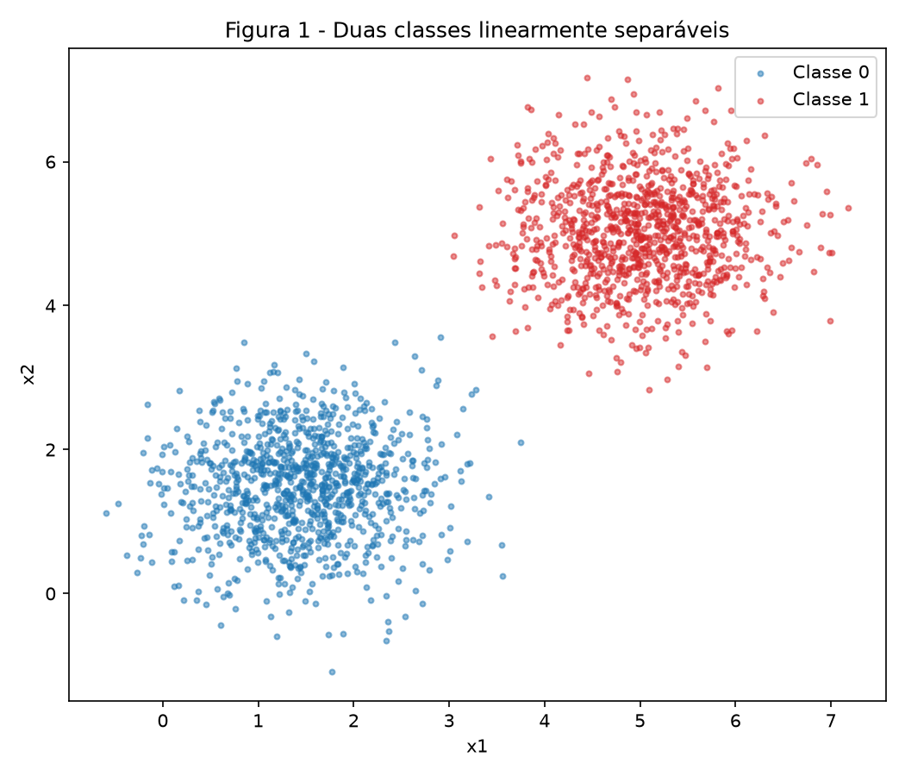
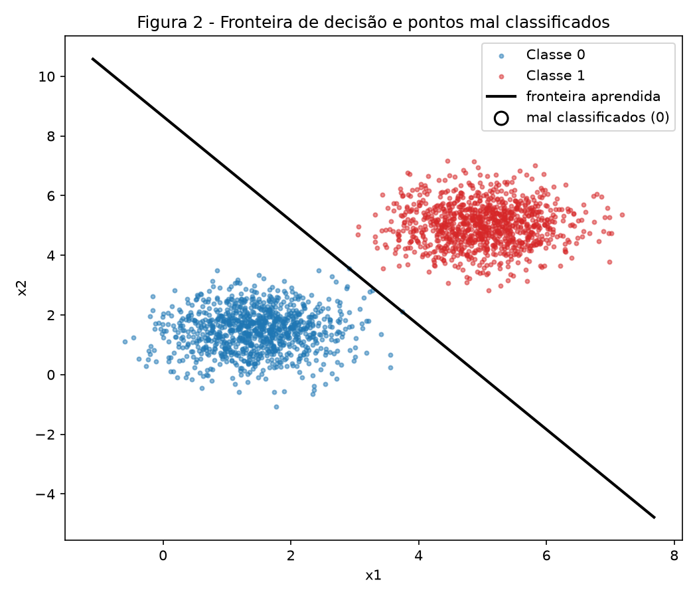
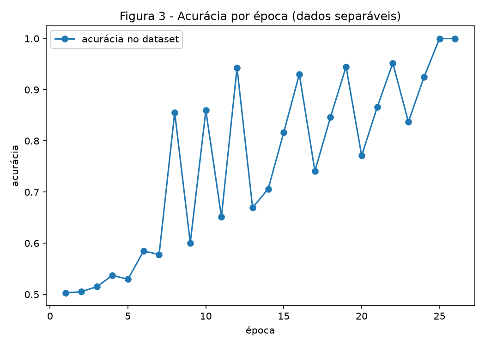
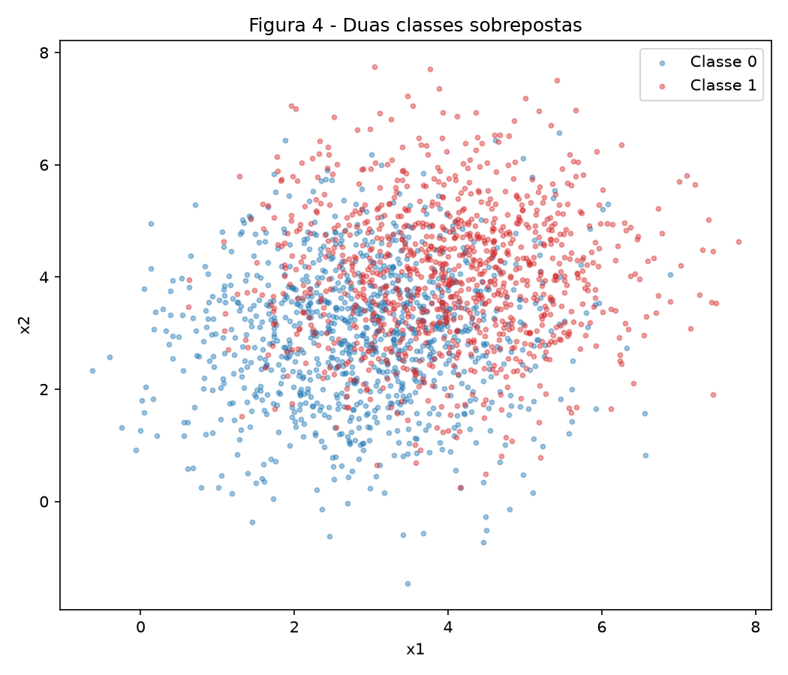
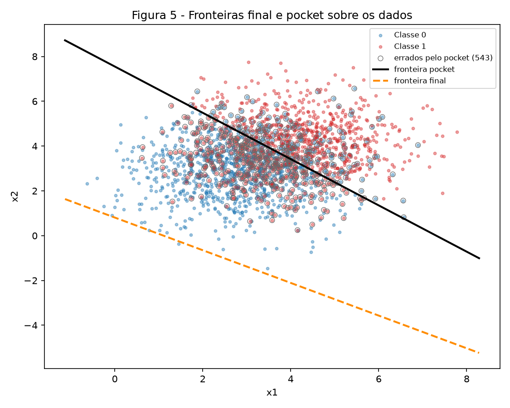
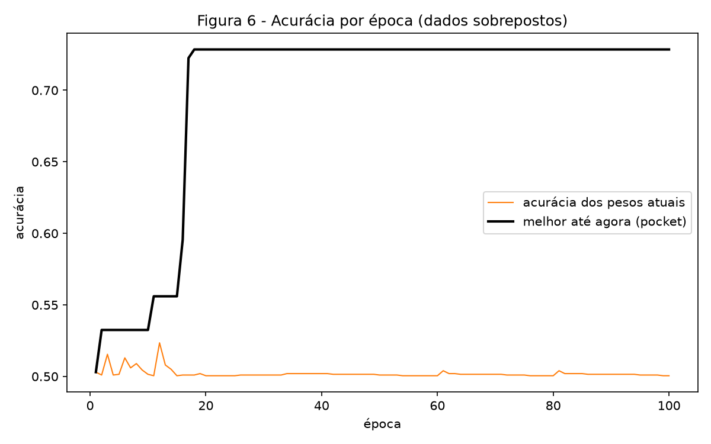

# Perceptron — Entendendo o Algoritmo e Suas Limitações

O fio condutor é a separabilidade. O mesmo perceptron é treinado em dois datasets: um que ele resolve e outro que não. O que interessa no segundo não é que ele falhe, e sim como falha.

!!! info "Uso de IA"
    Usei o Claude como apoio na escrita do código em `code/`, na geração das figuras e na revisão do texto. Acompanhei a construção passo a passo e discuti as decisões enquanto elas eram tomadas; sei explicar cada trecho do perceptron e cada número deste relatório. Todos os valores citados saem da execução dos scripts desta pasta.

!!! note "Reprodutibilidade e implementação"
    Cada script começa com `rng = np.random.default_rng(42)`. Bibliotecas: `numpy` e `matplotlib`.

    O perceptron é escrito do zero em `code/perceptron.py` — ativação, predição, regra de atualização e laço de treino. Nenhum modelo de terceiros é usado: `scikit-learn` não aparece nem no `import`. O Exercício 2 importa exatamente a mesma função `treinar` do Exercício 1, sem qualquer alteração.

## Abordagem e desafios

Escrevi o perceptron uma vez, num módulo próprio, e os dois exercícios o importam. O rastreio do pocket ficou dentro da mesma função de treino, sempre ativo: em dados separáveis ele termina coincidindo com os pesos finais, e em dados sobrepostos os dois se separam. Assim o Exercício 2 reutiliza a implementação literalmente, sem uma segunda versão do laço.

Dois pontos exigiram cuidado. O primeiro foi a regra de atualização: com rótulos 0/1 ela precisa ser dirigida pelo erro $(y - \hat{y})$, e não a forma $w \leftarrow w + \eta y x$ dos livros que usam rótulos $-1/+1$ — esta nunca atualizaria na Classe 0. O segundo foi a comparação de taxas de aprendizado no item 1D: para isolar o efeito de $\eta$, sorteei o $w$ inicial uma única vez e passei o mesmo vetor para as duas execuções. Se cada uma sorteasse o seu, a diferença observada misturaria dois efeitos.

---

## Exercício 1

Dados separáveis: o caso para o qual o perceptron foi projetado

### A — Gere os dados

1000 amostras por classe, normais multivariadas com covariância $0{,}5 I$:

| Classe | Média | Covariância |
|---|---|---|
| 0 | [1,5 ; 1,5] | diag(0,5 ; 0,5) |
| 1 | [5 ; 5] | diag(0,5 ; 0,5) |



As médias estão a $\sqrt{2 \cdot 3{,}5^2} \approx 4{,}95$ de distância, contra desvio padrão $\sqrt{0{,}5} \approx 0{,}71$ em cada eixo. A separação é de cerca de 7 desvios, e as nuvens não chegam a se tocar.

### B — Implemente o perceptron

Predição: $\hat{y} = \text{degrau}(w \cdot x + b)$, com $\text{degrau}(z) = 1$ se $z \ge 0$ e $0$ caso contrário.

Atualização, aplicada amostra a amostra:

$$w \leftarrow w + \eta\,(y - \hat{y})\,x, \qquad b \leftarrow b + \eta\,(y - \hat{y})$$

O fator $(y - \hat{y})$ vale $0$ quando a predição está correta, então amostras bem classificadas não movem nada. Vale $+1$ num falso negativo e $-1$ num falso positivo, e é isso que dá à regra o poder de corrigir os dois tipos de engano.

Inicialização: $w$ sorteado de $N(0\ ;\ 0{,}01)$ — saiu $w_0 = [0{,}002532\ ;\ 0{,}008952]$, de norma $0{,}0093$ — e $b = 0$. Taxa $\eta = 0{,}01$. O treino para quando uma passagem completa pelo dataset não produz nenhuma atualização, ou ao fim de 100 épocas.

### C — Treine e meça

| | |
|---|---|
| $w$ final | [0,0505 ; 0,0289] |
| $b$ final | −0,2500 |
| Épocas | **26** |
| Acurácia final | **1,0000** (2000 de 2000) |





A curva sobe rápido e estabiliza: a partir da segunda época a acurácia já está acima de 99%, e as épocas seguintes apenas ajustam a fronteira até que nenhum ponto fique do lado errado.

### D — Análise

**Por que dados separáveis convergem rápido.** A resposta está na regra: ela só age quando $(y - \hat{y}) \neq 0$. Amostras corretas passam pelo laço sem mover peso nenhum. Registrei quantas atualizações cada época produziu:

```
3, 3, 4, 4, 3, 4, 3, 4, 2, 4, 2, 4, 2, 3, 3, 3, 2, 3, 3, 2, 3, 3, 2, 3, 1, 0
```

São **73 atualizações em 26 épocas**, sobre 2000 amostras. Já na primeira época, 1997 das 2000 amostras não produziram alteração alguma. Como as nuvens estão a 7 desvios uma da outra, quase nenhum ponto cai perto da fronteira, e só esses poucos geram correção. Cada correção empurra a fronteira para longe do ponto que errou, o que reduz ainda mais o número de candidatos a erro — até que uma época inteira passa sem nenhum, o laço detecta isso e encerra. A parada não é um limite de tempo: é a constatação de que não há mais nada a corrigir.

**Mesma inicialização, $\eta = 1{,}0$.** Repeti o treino mudando apenas a taxa:

| | $\eta = 0{,}01$ | $\eta = 1{,}0$ |
|---|---|---|
| Épocas | 26 | **37** |
| Acurácia | 1,0000 | 1,0000 |
| $\|w\|$ | 0,0582 | 6,7638 |
| Direção $w/\|w\|$ | [0,8681 ; 0,4963] | [0,8679 ; 0,4967] |
| Distância da fronteira à origem | 4,2979 | 4,5832 |

As duas chegam a 100%, como esperado, mas por fronteiras diferentes. A diferença não está na inclinação — o ângulo entre as duas direções é de apenas **0,02°**, praticamente paralelas. Está na **posição**: uma reta fica definida pela direção de $w$ *e* pela distância $|b|/\|w\|$ até a origem, e essa distância difere em 0,29.

O que $\eta$ controla aqui é o peso relativo entre a inicialização aleatória e as correções. O $w$ inicial tem norma 0,0093 e cada atualização soma $\eta\|x\|$, com $\|x\| \approx 4{,}65$ neste dataset:

- com $\eta = 0{,}01$, cada passo vale cerca de 0,047 — apenas 5 vezes o $w$ inicial, que portanto ainda influencia o percurso;
- com $\eta = 1{,}0$, cada passo vale cerca de 4,65 — **500 vezes** o $w$ inicial, que é apagado logo na primeira correção.

Isso é verificável. Rodando com $\eta = 1{,}0$ a partir do $w$ sorteado obtive $w = [5{,}8706\ ;\ 3{,}3592]$ em 37 épocas; partindo de $w = 0$, obtive $[5{,}8681\ ;\ 3{,}3503]$, também em 37 épocas. Com a taxa alta, o treino se comporta como se a inicialização não existisse. Com a taxa baixa, ela participa, e é por isso que aquela execução convergiu em 26 épocas em vez de 37.

**O que aconteceria partindo de $w = 0$, $b = 0$.** Nesse caso $\eta$ não teria efeito nenhum. A prova é por indução sobre as atualizações.

Sejam dois treinos idênticos, um com $\eta_1$ e outro com $\eta_2$, ambos partindo de $w_0 = 0$ e $b_0 = 0$. Afirmo que em todo instante $t$ vale

$$w_t^{(2)} = c\,w_t^{(1)}, \qquad b_t^{(2)} = c\,b_t^{(1)}, \qquad c = \eta_2/\eta_1 > 0.$$

*Base:* em $t = 0$ ambos são o vetor nulo, e a relação vale para qualquer $c$.

*Passo:* suponha a relação válida em $t$. Para a amostra seguinte,

$$w_t^{(2)} \cdot x + b_t^{(2)} = c\,(w_t^{(1)} \cdot x + b_t^{(1)}),$$

e como $c > 0$ o sinal é o mesmo. Logo as duas execuções produzem **a mesma predição** $\hat{y}$, portanto o mesmo erro $e = y - \hat{y}$. Aplicando a regra:

$$w_{t+1}^{(2)} = w_t^{(2)} + \eta_2\,e\,x = c\,w_t^{(1)} + c\,\eta_1\,e\,x = c\,(w_t^{(1)} + \eta_1\,e\,x) = c\,w_{t+1}^{(1)},$$

e o mesmo para $b$. A relação se preserva. $\blacksquare$

Três consequências. As predições são idênticas em todo o treino, logo a sequência de erros é idêntica e **o número de épocas é o mesmo**. A fronteira é o conjunto $\{x : w \cdot x + b = 0\}$, e multiplicar $w$ e $b$ por uma constante positiva não altera esse conjunto: **a fronteira é literalmente a mesma reta**. E $\eta$ sobrevive apenas como um fator de escala em $\|w\|$, que não é usado por nada.

Conferi numericamente. Partindo de zero, $\eta = 0{,}01$ deu $w = [0{,}058681\ ;\ 0{,}033503]$ e $b = -0{,}310000$; $\eta = 1{,}0$ deu $w = [5{,}868084\ ;\ 3{,}350287]$ e $b = -31{,}000000$. As razões são **exatamente 100,0000** nas três componentes, e ambas as execuções levaram **37 épocas**. É por isso que o item B proíbe partir do zero: sem inicialização não nula, o item anterior não teria o que comparar.

---

## Exercício 2

Dados sobrepostos: o caso que o perceptron não resolve

### A — Gere os dados

1000 amostras por classe, agora com médias próximas e variância três vezes maior:

| Classe | Média | Covariância |
|---|---|---|
| 0 | [3 ; 3] | diag(1,5 ; 1,5) |
| 1 | [4 ; 4] | diag(1,5 ; 1,5) |



As médias estão a $\sqrt{2} \approx 1{,}41$ de distância, contra desvio padrão $\sqrt{1{,}5} \approx 1{,}22$ por eixo — pouco mais de um desvio. As nuvens se interpenetram.

### B — Treine guardando os melhores pesos

Mesma função de treino, mesma taxa $\eta = 0{,}01$, limite de 100 épocas. O laço **não parou sozinho**: chegou às 100 épocas ainda produzindo atualizações (4 na última época).

| | $w$ | $b$ | Acurácia |
|---|---|---|---|
| Pesos finais | [0,0361 ; 0,0494] | −0,0400 | **0,5005** |
| Pesos do pocket | [0,0068 ; 0,0066] | −0,0500 | **0,7285** |

O melhor do pocket ocorreu na **época 18**. Os pesos finais acertam praticamente o mesmo que chutar.

### C — Figuras





### D — Análise

**Por que os pesos finais vão tão mal e onde a fronteira deles foi parar.** A resposta é geométrica e está na Figura 5: a fronteira final passa **fora da nuvem de pontos**.

Uma reta $w \cdot x + b = 0$ fica a $|b|/\|w\|$ da origem. Medindo:

| | Distância até a origem |
|---|---|
| Centro dos dados, [3,47 ; 3,49] | 4,92 |
| Fronteira **final** | **0,65** |
| Fronteira **pocket** | **5,25** |

A fronteira do pocket passa a 5,25 da origem, praticamente em cima do centro dos dados, e por isso corta a nuvem ao meio. A final passa a 0,65 — muito aquém da nuvem inteira. O resultado é que ela classifica **1999 das 2000 amostras como classe 1**: não é um classificador, é quase uma constante. Acerta 1001 de 2000, que é o tamanho da classe 1 mais um ponto. Daí os 50,05%.

Por que o laço a deixa ali é o ponto que a dica do enunciado indica. Cada erro move $w$ em $\eta\,\|x\| \approx 0{,}01 \times 5{,}07 = 0{,}051$ e move $b$ em apenas $\eta = 0{,}010$ — **cinco vezes menos**. Como os dados não são separáveis, os erros nunca cessam, e os dois tipos de erro se alternam. Só que $w$ acumula deslocamento cinco vezes mais depressa que $b$. A razão $|b|/\|w\|$, que é exatamente a distância da fronteira à origem, tende a encolher: o denominador cresce mais rápido que o numerador. A fronteira é empurrada em direção à origem, para longe de onde os dados estão. Nada no algoritmo impede isso, porque o perceptron não tem função de custo a minimizar — ele só reage ao último erro que viu.

O pocket resolve sem tocar no laço: guarda uma cópia dos pesos sempre que a acurácia bate o recorde. Repare na Figura 6 que a curva laranja, medida ao fim de cada época, **nunca chega a 73%** — ela fica presa em torno de 50%. A configuração boa aparece *no meio* da época 18 e é destruída pelas atualizações seguintes antes que a época termine. Só o pocket, que confere após cada atualização, consegue capturá-la.

**Figura 3 contra Figura 6.** No Exercício 1 a curva sobe e estabiliza em 1,0, porque as atualizações cessam. Aqui ela oscila em torno de 0,50 até o fim e nunca assenta, porque as atualizações nunca cessam.

O teorema da convergência do perceptron (Novikoff) garante o seguinte: **se** existir um hiperplano que separe as classes com margem $\gamma > 0$, e se $\|x\| \le R$ para toda amostra, então o algoritmo comete no máximo $(R/\gamma)^2$ atualizações antes de parar. A garantia é de terminação em número finito de passos.

A hipótese que este dataset viola é a primeira: **separabilidade linear**. Com as nuvens interpenetradas, não existe reta com margem positiva — qualquer reta deixa pontos das duas classes do lado errado. Sem essa hipótese, o limite $(R/\gamma)^2$ nem sequer é um número ($\gamma$ seria zero ou negativo), e o teorema não diz nada. O algoritmo continua rodando indefinidamente, que é exatamente o observado.

**Mais épocas resolvem? Um $\eta$ menor resolve?** Nenhum dos dois, e a razão está na regra de atualização.

Mais épocas não resolvem porque o laço só para quando uma passagem inteira não gera erro, e isso exige que exista uma reta com zero erros — que é justamente o que não existe aqui. Na centésima época o treino ainda produzia 4 atualizações. Rodar mil épocas produziria mil épocas de oscilação, não convergência. O problema não é falta de tempo, é ausência de solução.

Um $\eta$ menor também não resolve, por dois motivos. Primeiro, $\eta$ não aparece em lugar nenhum do critério de erro: a predição depende do sinal de $w \cdot x + b$, e quem determina se uma amostra erra é a posição da fronteira, não o tamanho do passo. Reduzir $\eta$ deixa os passos menores, mas os mesmos pontos continuam do lado errado. Segundo, como provei no item 1D, se o treino partisse de $w = 0$ a taxa seria matematicamente irrelevante — a fronteira e a contagem de épocas seriam idênticas para qualquer $\eta$. Partindo de $w \neq 0$, um $\eta$ menor apenas faz a inicialização aleatória pesar mais no resultado, o que muda a fronteira sem melhorá-la.

O que de fato ajuda é o que o próprio exercício pede: guardar o melhor resultado visto, em vez de confiar no último. Isso eleva a acurácia de 50,05% para 72,85% sem alterar uma linha do laço de treino. Para ir além dos ~73%, seria preciso trocar de modelo — a melhor reta possível para estes dados também tem esse teto, e superá-lo exige uma fronteira que não seja uma reta.

---

## Código

### `code/perceptron.py`

```python
--8<-- "docs/exercises/perceptron/code/perceptron.py"
```

### `code/ex1_separavel.py`

```python
--8<-- "docs/exercises/perceptron/code/ex1_separavel.py"
```

### `code/ex2_sobreposto.py`

```python
--8<-- "docs/exercises/perceptron/code/ex2_sobreposto.py"
```

---

## Resumo dos resultados

| # | Quantidade | Valor |
|---|---|---|
| 1 | Exercício 1 — $w$ e $b$ finais | $w = [0{,}0505\ ;\ 0{,}0289]$, $b = -0{,}2500$ |
| 2 | Exercício 1 — épocas até convergir | 26 |
| 3 | Exercício 1 — acurácia final | 1,0000 (2000 de 2000) |
| 4 | Exercício 1 — épocas e acurácia final com $\eta = 1{,}0$ | 37 épocas, acurácia 1,0000 |
| 5 | Exercício 2 — $w$ e $b$ finais | $w = [0{,}0361\ ;\ 0{,}0494]$, $b = -0{,}0400$ |
| 6 | Exercício 2 — acurácia dos pesos finais | 0,5005 |
| 7 | Exercício 2 — acurácia dos pesos do pocket | 0,7285 |
| 8 | Exercício 2 — época em que o melhor do pocket ocorreu | 18 |
